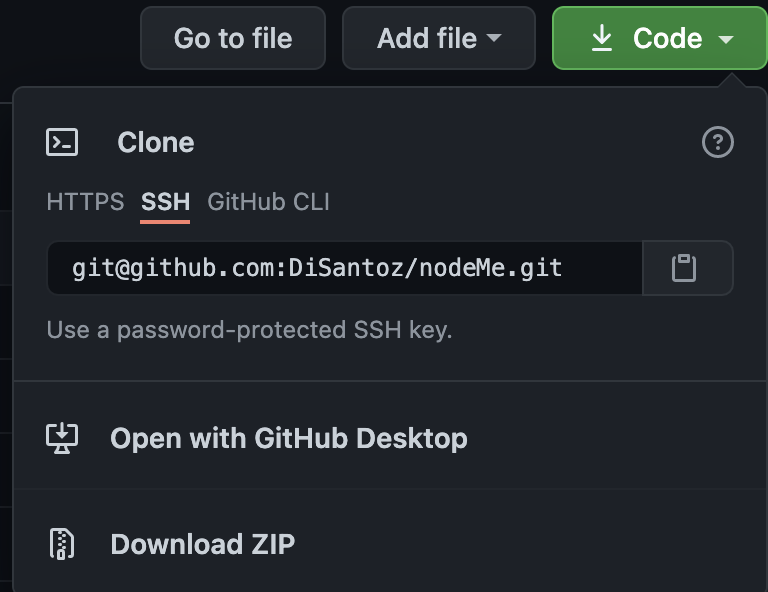
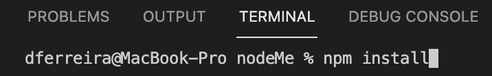
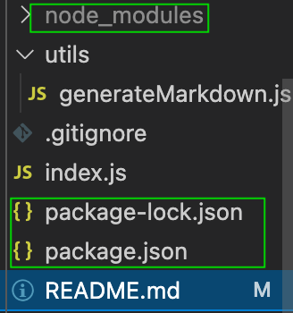
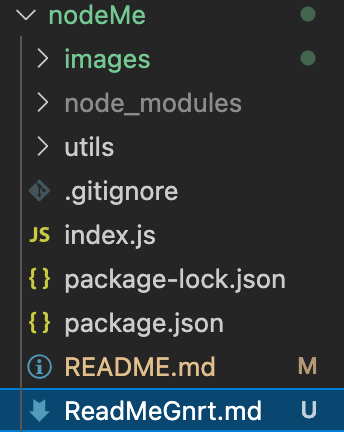
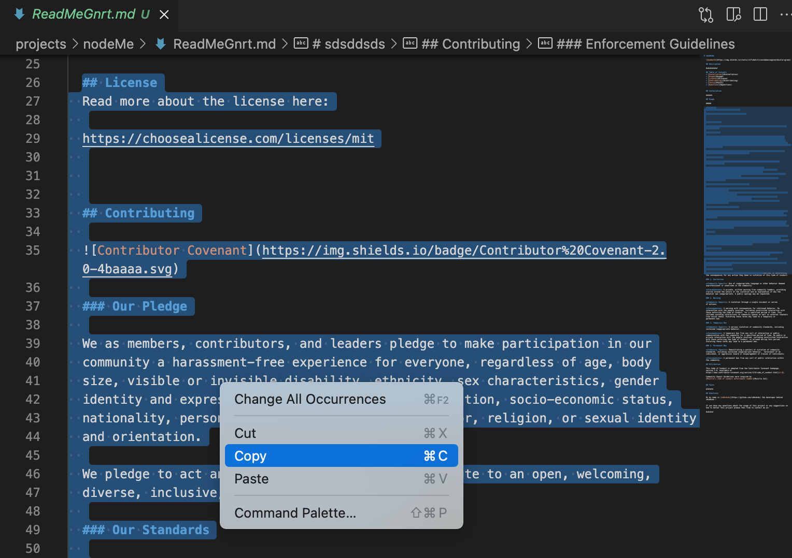
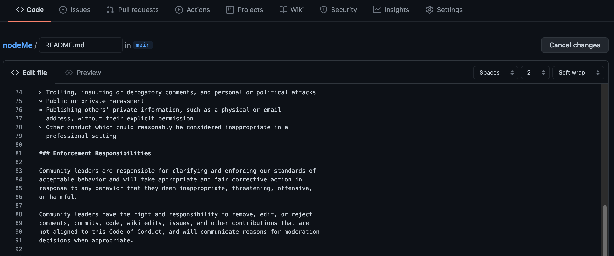

# nodeMe

  
  
  ## Description

  Using Node and NPM Inquirer I developed a command-line application that dynamically generates a professional README file based on the user's inputs!

  ## Table of Contents
  * [Installation](#installation)
  * [Usage](#usage)
  * [Technologies Used](#technologies-used)
  * [License](#license)
  * [Contributing](#contributing)
  * [Tests](#tests)
  * [Questions](#questions)
  

  ## Installation

  1. Git clone my repository 

  

  2. On the command line, in the root of the directory type 'npm install' 

  

  3. Make sure that package.json, package-lock.json and node_modules is all properly displaying

  

  ## Usage

  Please see attached [video](https://drive.google.com/file/d/12n57CULU_-4zRMGjopsoyj6mc26hmWZS/view?usp=sharing) on how to use this application!

  

  ## License
  Read more about the license here:
  
  https://choosealicense.com/licenses/mpl-2.0
  
  ## Technologies Used
  
  * Node
  * NPM Inquirer
  * NPM Jest
  
  ## Contributing
  
  
  
  ### Our Pledge
  
  We as members, contributors, and leaders pledge to make participation in our
  community a harassment-free experience for everyone, regardless of age, body
  size, visible or invisible disability, ethnicity, sex characteristics, gender
  identity and expression, level of experience, education, socio-economic status,
  nationality, personal appearance, race, caste, color, religion, or sexual identity
  and orientation.
  
  We pledge to act and interact in ways that contribute to an open, welcoming,
  diverse, inclusive, and healthy community.
  
  ### Our Standards
  
  Examples of behavior that contributes to a positive environment for our
  community include:
  
  * Demonstrating empathy and kindness toward other people
  * Being respectful of differing opinions, viewpoints, and experiences
  * Giving and gracefully accepting constructive feedback
  * Accepting responsibility and apologizing to those affected by our mistakes,
    and learning from the experience
  * Focusing on what is best not just for us as individuals, but for the
    overall community
  
  Examples of unacceptable behavior include:
  
  * The use of sexualized language or imagery, and sexual attention or
    advances of any kind
  * Trolling, insulting or derogatory comments, and personal or political attacks
  * Public or private harassment
  * Publishing others' private information, such as a physical or email
    address, without their explicit permission
  * Other conduct which could reasonably be considered inappropriate in a
    professional setting
  
  ### Enforcement Responsibilities
  
  Community leaders are responsible for clarifying and enforcing our standards of
  acceptable behavior and will take appropriate and fair corrective action in
  response to any behavior that they deem inappropriate, threatening, offensive,
  or harmful.
  
  Community leaders have the right and responsibility to remove, edit, or reject
  comments, commits, code, wiki edits, issues, and other contributions that are
  not aligned to this Code of Conduct, and will communicate reasons for moderation
  decisions when appropriate.
  
  ### Scope
  
  This Code of Conduct applies within all community spaces, and also applies when
  an individual is officially representing the community in public spaces.
  Examples of representing our community include using an official e-mail address,
  posting via an official social media account, or acting as an appointed
  representative at an online or offline event.
  
  ### Enforcement
  
  Instances of abusive, harassing, or otherwise unacceptable behavior may be
  reported to the community leaders responsible for enforcement.

  All complaints will be reviewed and investigated promptly and fairly.
  
  All community leaders are obligated to respect the privacy and security of the
  reporter of any incident.
  
  ### Enforcement Guidelines
  
  Community leaders will follow these Community Impact Guidelines in determining
  the consequences for any action they deem in violation of this Code of Conduct:
  
  ### 1. Correction
  
  **Community Impact**: Use of inappropriate language or other behavior deemed
  unprofessional or unwelcome in the community.
  
  **Consequence**: A private, written warning from community leaders, providing
  clarity around the nature of the violation and an explanation of why the
  behavior was inappropriate. A public apology may be requested.
  
  ### 2. Warning
  
  **Community Impact**: A violation through a single incident or series
  of actions.
  
  **Consequence**: A warning with consequences for continued behavior. No
  interaction with the people involved, including unsolicited interaction with
  those enforcing the Code of Conduct, for a specified period of time. This
  includes avoiding interactions in community spaces as well as external channels
  like social media. Violating these terms may lead to a temporary or
  permanent ban.
  
  ### 3. Temporary Ban
  
  **Community Impact**: A serious violation of community standards, including
  sustained inappropriate behavior.
  
  **Consequence**: A temporary ban from any sort of interaction or public
  communication with the community for a specified period of time. No public or
  private interaction with the people involved, including unsolicited interaction
  with those enforcing the Code of Conduct, is allowed during this period.
  Violating these terms may lead to a permanent ban.
  
  ### 4. Permanent Ban
  
  **Community Impact**: Demonstrating a pattern of violation of community
  standards, including sustained inappropriate behavior,  harassment of an
  individual, or aggression toward or disparagement of classes of individuals.
  
  **Consequence**: A permanent ban from any sort of public interaction within
  the community.
  
  ## Attribution
  
  This Code of Conduct is adapted from the Contributor Covenant homepage,
  version 2.0, available at
  https://www.contributor-covenant.org/version/2/0/code_of_conduct.html[v2.0].
  
  Community Impact Guidelines were inspired by 
  [Mozilla's code of conduct enforcement ladder][Mozilla CoC].
  
  
  ## Tests

  After following the installation process and usage steps above, generate your first READMe! 

  

  You then can simply copy the contents of the ReadMeGnrt file.

  

  Then paste it to your projects own READMe in VSCode or in GitHub and save a ton of time!

  

  ## Questions
  
  Hi my name is [DiSantoz](https://github.com/DiSantoz) the developer behind nodeMe !

  
  If you have any questions about the usage of this project or any suggestions on how to better this project please feel free to contact me at:

  dferreira91@outlook.com

